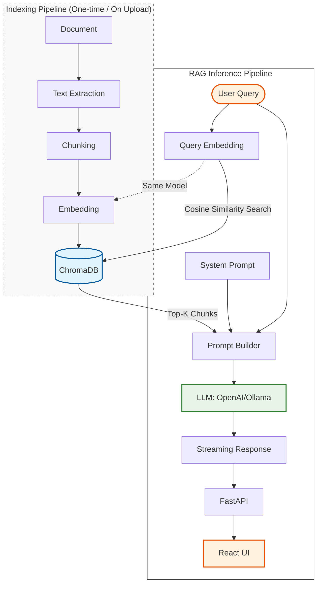

```mermaid
graph TD
    subgraph Indexing ["Indexing Pipeline (One-time / On Upload)"]
        direction LR
        Doc[Document] --> Ext[Text Extraction]
        Ext --> Chunk[Chunking]
        Chunk --> Emb[Embedding]
        Emb --> DB[(ChromaDB)]
    end

    subgraph Inference ["RAG Inference Pipeline"]
        direction TB
        UQ([User Query]) --> QEmb[Query Embedding]
        QEmb -.->|Same Model| Emb
        QEmb -- "Cosine Similarity Search" --> DB
        DB -- "Top-K Chunks" --> PB[Prompt Builder]
        SP[System Prompt] --> PB
        UQ --> PB
        PB --> LLM[LLM: OpenAI/Ollama]
        LLM --> SR[Streaming Response]
        SR --> FA[FastAPI]
        FA --> UI[React UI]
    end

    %% Styling
    style Indexing fill:#f9f9f9,stroke:#666,stroke-dasharray: 5 5
    style Inference fill:#fff,stroke:#333
    style DB fill:#e1f5fe,stroke:#01579b,stroke-width:2px
    style LLM fill:#e8f5e9,stroke:#2e7d32,stroke-width:2px
    style UI fill:#fff3e0,stroke:#e65100,stroke-width:2px
    style UQ fill:#fff3e0,stroke:#e65100,stroke-width:2px
```